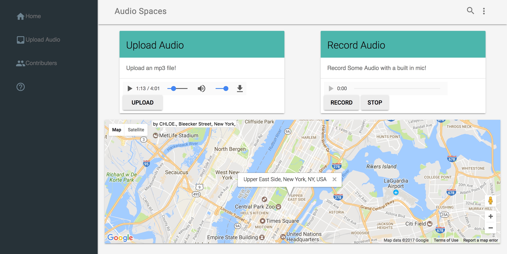

# Audio Places

How to Run Locally:
- get an api key from https://developers.google.com/maps/documentation/javascript/get-api-key and put in index.html in the last script tag before </body> where it says YOUR_API_KEY
- npm install
- npm start
- open index.html

To Run a dev environment:
- npm run dev

Note:
- If you are using Chrome, you may need to enable audio flags.
  - To do this enter 'chrome://flags/#enable-tab-audio-muting' in Chrome's address bar

Features:
- Upload audio files and link them to a location
- Record audio files and link them to a location
- View sound recordings from different places
